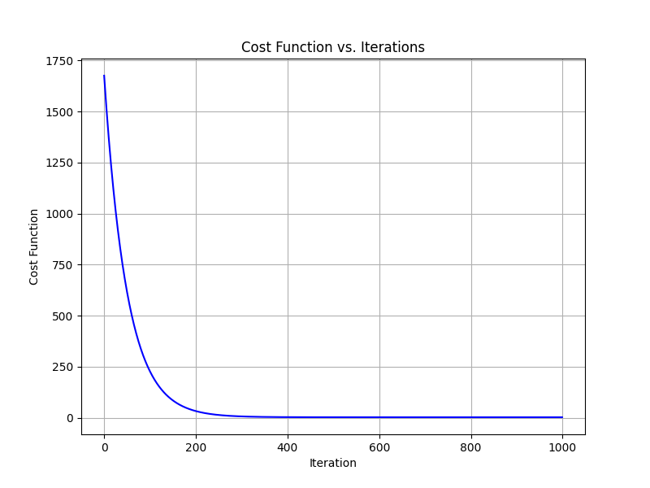

# Multiple Linear Regression from Scratch

This project demonstrates the implementation of multiple linear regression and gradient descent using only NumPy and Pandas, without relying on external machine learning libraries like scikit-learn. The project includes loading and preprocessing data, performing matrix operations to compute the regression coefficients, making predictions, and evaluating the model using the cost function.

## Formulas Used

### Multiple Linear Regression Model

The multiple linear regression model is represented as:

$$ y = \beta_0 + \beta_1 x_1 + \beta_2 x_2 + \ldots + \beta_n x_n $$

### Normal Equation

$$ y = \beta X $$

Multiplying X^T on both sides and moving the term to the denominator of y calculates the wieghts. 
The regression coefficients are computed using the normal equation:

$$ \beta = (X^T X)^{-1} X^T y $$

### Cost Function

The cost function used to evaluate the model is the mean squared error:

$$ J(\beta) = \frac{1}{2m} \sum_{i=1}^m (X \beta - y)^2 $$

### Gradient Descent

The gradient descent algorithm updates the weights to minimize the cost function:

$$ w = w - \alpha \frac{\partial J(w, b)}{\partial w} $$

$$ b = b - \alpha \frac{\partial J(w, b)}{\partial b} $$

## Method Followed

1. **Loading and Preprocessing Data**:
   - Data is loaded from a CSV file.
   - Categorical data is converted to numerical values.
   - Features are normalized to have a mean of 0 and a standard deviation of 1.
   - A column of ones is added to the feature matrix to account for the intercept term.

2. **Computing Regression Coefficients**:
   - The normal equation is used to compute the regression coefficients.

3. **Making Predictions**:
   - The model uses the computed coefficients to make predictions on the dataset.

4. **Evaluating the Model**:
   - The cost function is computed to evaluate the model's performance.

5. **Gradient Descent**:
   - Gradient descent is implemented to iteratively update the weights and bias to minimize the cost function.

6. **Plotting the Cost Function**:
   - To visualize the effectiveness of the gradient descent algorithm, I plotted the cost function (Mean Squared Error) against the number of iterations. This plot demonstrates how the cost function decreases as the algorithm converges towards the optimal regression coefficients.

Here's the plot of the cost function for every iteration of gradient descent:



This plot helps in understanding the convergence behavior of the gradient descent algorithm, allowing us to see how quickly the algorithm reaches a minimum. By monitoring the cost function's value at each iteration, you can ensure that the model is learning as expected and adjust the learning rate if necessary.


## Dependencies
- Pandas
- Numpy

## References
https://www.coursera.org/learn/machine-learning/ungradedLab/7GEJh/optional-lab-multiple-linear-regression

## Usage
To Clone the repository:
   ```bash
   git clone https://github.com/arshia-pelathur/Student_Performance.git


